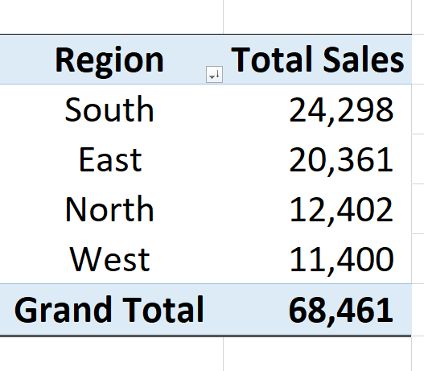

# Sales Performance Analysis for a Retail Store

## Project Aim

The aim of this analysis is to  analyse the sales performance of a retail store and to uncover key insights such as top-selling products, regional performance, monthly sales trends and other important findings. 

-----------

## Tools Used
1. Microsoft EXCEL for Data Cleaning and Data Summarization
2. SQL for Data Analysis
3. Power BI for Data Cleaning, Data Transformation and Data Visualization
4. GitHub for Report Documentation
----------

## * Summarization of total sales per region
This was done with the use of Microsoft EXCEL and the result is displayed 

The highest total sales (24,298) was recorded at South Region while the lowest total sales was recorded at West Region. West Region had the lowest sales (11,400) with reasons probably low advertisement, staff attitude etc.
We recommend that the company look keenly into the West region and make some adjustments so as to boost sales in that region.

-----------
## * Summarization of total sales per product
This was done with the use of Microsoft EXCEL and the result is displayed below

The product with the highest total sales is hat while the product with the lowest total sales is jacket. 23% of the total sales came from hat.
We recommend that more hats be supplied to the firm to boost the business.
Jacket had the lowest quantity sold with 8% sales due to reasons probably choice and preference of customers or the likes.
The management of the company might take a survey to get interested jackets brand from society and introduce such jackets to the company.

## * Summarization of total sales and total revenue per product at a glance
This was done with the use of Microsoft EXCEL and the result is displayed below.

Though hat has the highest sales (15,929), it is not the product with the highest revenue. 
The product with the highest revenue (613,380) is shoe which has the second largest sales. 

--------

## * Summarization of total sales per region per product at a glance
This was done with the use of Microsoft EXCEL and the result is displayed below.

- At South region, hat and jacket were not available for sale.
- At East region, gloves and socks were not available for sale.
- At North Region, shoes, gloves and socks were not available for sale.
- At West Region, shirt and jacket were not available for sale.

- At South region, shoes had the highest sale of 9,930 while socks had the lowest sale of 4,464.
- At East region, hat had the highest sale of 8,871 while shoes had the lowest sale of 2,480.
- At North Region, shirt had the highest sale of 6,448 while jacket  had the lowest sale of 2,482.
- At West Region, hat had the highest sale of 3,486 while shoes had the lowest sale of 1,992.

It is interesting to note that the product with the highest sales in one region happen to be the product with the lowest sale in another region. For exampe, shoes had the highest sales at South region but it had the lowest sale at East region.

-------

## Using EXCEL Functions to calculate Average sales per product

We used EXCEL Function (AVERAGEIF) to calculate the average sales per product.
The function codes are displayed below:

`EXCEL`

=AVERAGEIF($C$2:$C$9922,"Gloves",$F$2:$F$9922)
=AVERAGEIF($C$2:$C$9922,"Hat",$F$2:$F$9922)
=AVERAGEIF($C$2:$C$9922,"Jacket",$F$2:$F$9922)
=AVERAGEIF($C$2:$C$9922,"Shirt",$F$2:$F$9922)
=AVERAGEIF($C$2:$C$9922,"Shoes",$F$2:$F$9922)
=AVERAGEIF($C$2:$C$9922,"Socks",$F$2:$F$9922)
